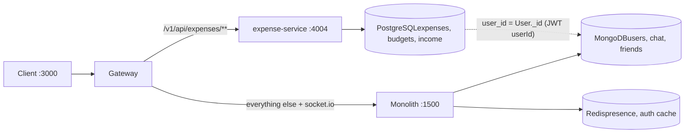
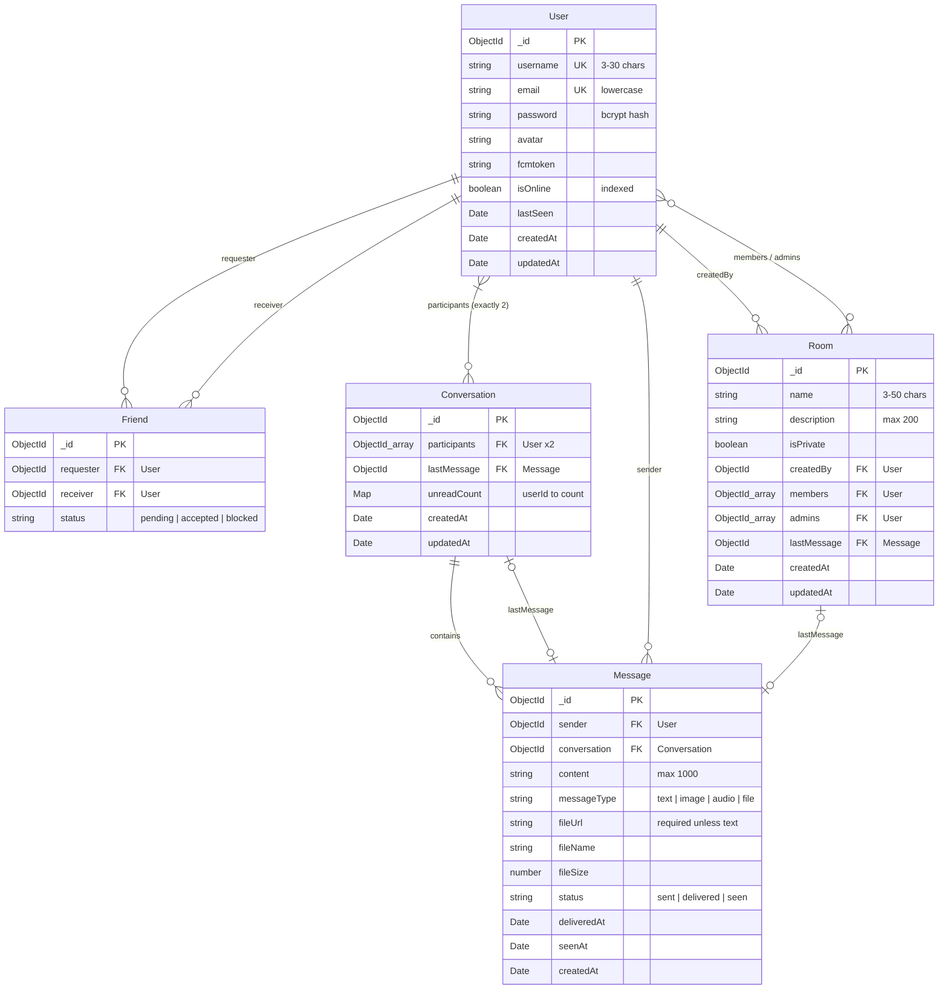
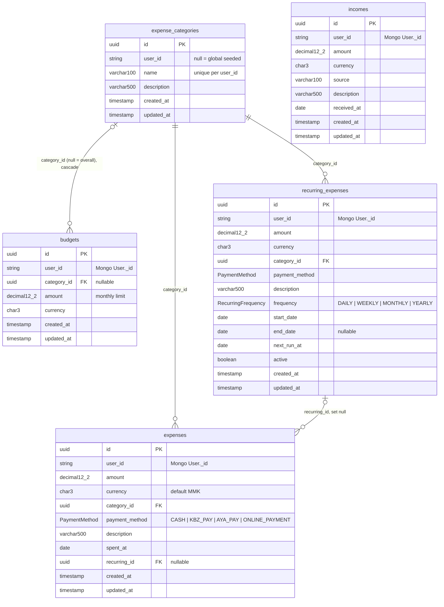

# Messaging Socket Data Model

The app keeps data in three stores. The monolith owns users, chat and friends in MongoDB. The expense service owns money data in PostgreSQL. Redis holds short-lived presence and auth cache. The stores share one key: the Mongo `User._id`, which Postgres stores as a plain `user_id` string with no foreign key.

## How the stores connect

## MongoDB

Mongoosesrc/models/\*.ts

### Indexes

- **users** username, email (unique), isOnline
- **conversations** participants, participants.0 + participants.1, lastMessage
- **messages** conversation + createdAt desc, sender, status
- **rooms** name, members, isPrivate
- **friends** none besides \_id

### Rules in code

- **Conversation** pre-save rejects anything but 2 unique participants
- **Conversation** findOrCreateConversation sorts the 2 ids so lookup is stable
- **User** pre-save hashes password (bcrypt, cost 12)
- **User** JWT payload: userId, email, username

## PostgreSQL

Prismaservices/expense-service/prisma/schema.prisma

### Indexes and constraints

- **expenses** (user_id, spent_at), (user_id, category_id)
- **expense_categories** unique (user_id, name), plus partial unique name WHERE user_id IS NULL
- **budgets** unique (user_id, category_id), plus partial unique user_id WHERE category_id IS NULL
- **incomes** (user_id, received_at)
- **recurring_expenses** (user_id, active, next_run_at)

### Rules in code

- **categories** a user sees global rows plus their own; only their own can be edited
- **budgets** warning at 80% used, flagged when exceeded
- **recurring** due expenses are created on read; next_run_at guard stops duplicates
- **all tables** every query filters by user_id from the JWT

## Redis

node-redissrc/socket/index.ts, src/middleware/auth.ts

### connectedUsers

- **hash** socket.id → user entry JSON. Set on connect, removed on disconnect.

### userSockets

- **hash** userId → socket.id. Used to route private messages and read receipts.

### user:{userId}

- **string** cached user for the auth middleware, with expiry. Deleted when the user changes.

## Things the schema doesn't enforce

**Friend has no timestamps.** The interface declares `createdAt` and `updatedAt`, but the schema has no `{ timestamps: true }`, so they are never saved.

**Duplicate friend requests are possible.** There is no unique index on `(requester, receiver)`, and nothing stops A→B and B→A both existing.

**Room messages have nowhere to live.** `Room.lastMessage` points at Message, but `Message.conversation` is required and there is no `room` field.

**No cross-database cleanup.** Deleting a Mongo user leaves their Postgres rows behind, because `user_id` is not a real foreign key.

**One socket per user.** `userSockets` stores a single socket.id, so a second tab or device replaces the first.